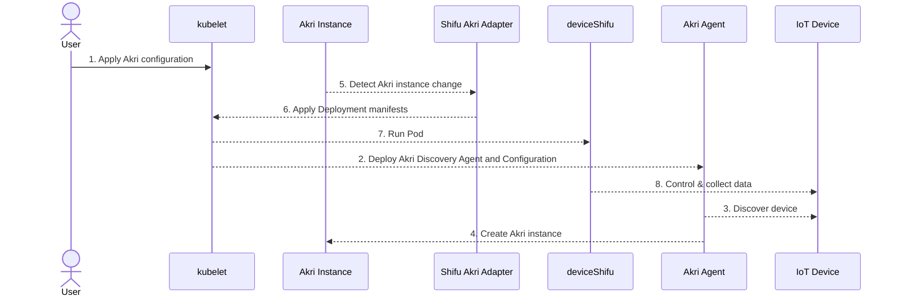

# Shifu Akri Adapter

## Introduction

Shifu Akri Adapter is a Kubernetes controller that manages Shifu from Akri Instances. It listens to Akri instance changes and deploys the corresponding DeviceShifu to control and collect data from IoT devices.

Read more about [Shifu](https://github.com/Edgenesis/shifu/)

## Flow Diagram



## Setup

### Build Docker Image

```bash
make build
```

### Load Docker Images to Cluster

For a kind cluster:

```bash
kind create cluster --config=manifests/kind/config.yaml
kind load docker-image edgenesis/shifu-akri-adapter:nightly
kind load docker-image edgenesis/shifu-akri-rtsp-discovery:nightly
kind load docker-image edgenesis/shifu-akri-s7-discovery:nightly
```

For a k3s cluster:

```bash
docker save edgenesis/shifu-akri-adapter:nightly | k3s ctr image import -
docker save edgenesis/shifu-akri-rtsp-discovery:nightly | k3s ctr image import -
docker save edgenesis/shifu-akri-s7-discovery:nightly | k3s ctr image import -
```

## Deploy

### Install Shifu

```bash
kubectl apply -f https://raw.githubusercontent.com/Edgenesis/shifu/v0.63.0/pkg/k8s/crd/install/shifu_install.yml
```

### Deploy Akri Discovery for OPC UA, RTSP, and S7

```bash
helm repo add akri-helm-charts https://project-akri.github.io/akri/
helm install akri akri-helm-charts/akri -n devices -f manifests/values.yaml
kubectl apply -f manifests/ds-s7/akri-s7-discovery-ds.yaml -n devices
```

### Deploy Shifu ConfigMap

```bash
kubectl create secret generic deviceshifu-secret --from-literal=username=guest --from-literal=password=HelloShifu -n deviceshifu
kubectl apply -f manifests/configmap
```

### Deploy Shifu Akri Adapter

```bash
kubectl apply -f shifu-akri-adapter/deployment.yaml
```

## Interact with Devices via Traefik Ingress and k3s

### Apply Traefik IngressRoute

```bash
kubectl apply -f manifests/traefik-route.yaml
```

Access the RTSP stream at: `http://{Node IP}/camera/stream?timeout=0`

### Toggle PLC Output

```bash
curl "http://{Node IP}/plc/sendsinglebit?rootaddress=Q&address=0&start=0&digit=1&value=1"
curl "http://{Node IP}/plc/sendsinglebit?rootaddress=Q&address=0&start=0&digit=1&value=0"
```

### Modify LED Output

```bash
curl "http://{Node IP}/opcua-led/number"
curl -XPOST -d '{"value":2999}' "http://{Node IP}/opcua-led/number"
curl -XPOST -d '{"value":1999}' "http://{Node IP}/opcua-led/number"
```

## Interact with Devices using Port-Forward

### Create Test Nginx Pod

```bash
kubectl run nginx --image=nginx:1.23 -n deviceshifu
```

### Access RTSP Stream

```bash
kubectl port-forward svc/deviceshifu-rtsp-57a51a -n deviceshifu 3000:
```

### Toggle PLC Output

```bash
kubectl exec -it -n deviceshifu nginx -- curl "deviceshifu-s7-9f6dc8/sendsinglebit?rootaddress=Q&address=0&start=0&digit=1&value=1"; echo
kubectl exec -it -n deviceshifu nginx -- curl "deviceshifu-s7-9f6dc8/sendsinglebit?rootaddress=Q&address=0&start=0&digit=1&value=0"; echo
```

### Modify LED Output

```bash
kubectl exec -it -n deviceshifu nginx -- curl "deviceshifu-akri-opcua-led-e6b66d/number"
kubectl exec -it -n deviceshifu nginx -- curl -XPOST -d '{"value":2999}' "deviceshifu-akri-opcua-led-e6b66d/number"
kubectl exec -it -n deviceshifu nginx -- curl -XPOST -d '{"value":1999}' "deviceshifu-akri-opcua-led-e6b66d/number"
```

## Interact with Devices via Nginx Ingress

### Deploy Nginx Ingress

```bash
kubectl apply -f https://kind.sigs.k8s.io/examples/ingress/deploy-ingress-nginx.yaml
```

### Apply Ingress

```bash
kubectl apply -f manifests/ingress.yaml
```

Access the RTSP stream at: http://localhost:30080/camera/stream?timeout=0

### Toggle PLC Output

```bash
curl "http://localhost:30080/plc/sendsinglebit?rootaddress=Q&address=0&start=0&digit=1&value=1"
curl "http://localhost:30080/plc/sendsinglebit?rootaddress=Q&address=0&start=0&digit=1&value=0"
```

### Modify LED Output

```bash
curl "http://localhost:30080/opcua-led/number"
curl -XPOST -d '{"value":2999}' "http://localhost:30080/opcua-led/number"
curl -XPOST -d '{"value":1999}' "http://localhost:30080/opcua-led/number"
```

## Cleanup

```bash
kubectl delete -f manifests/ds-s7/akri-s7-discovery-ds.yaml -n devices
kubectl delete akric -n devices akri-opcua-led rtsp
helm uninstall -n devices akri
kubectl delete -f https://raw.githubusercontent.com/Edgenesis/shifu/v0.63.0/pkg/k8s/crd/install/shifu_install.yml
```
